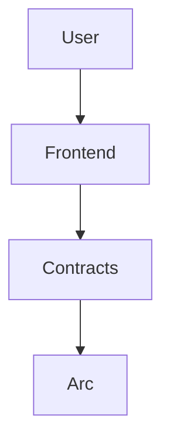
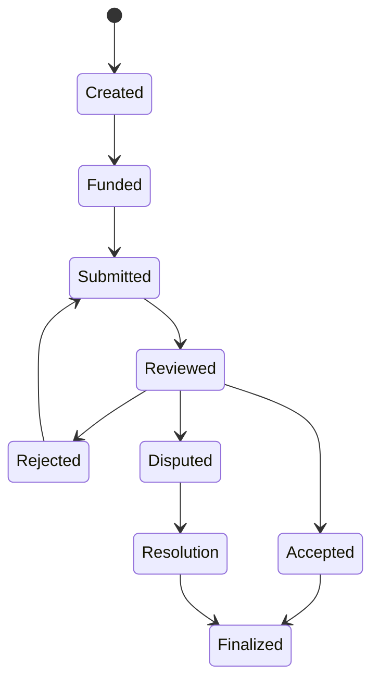

# ArcProof
Deterministic Work Settlement Infrastructure for Onchain Trust Systems

ArcProof is a deterministic work settlement layer built on Arc. It converts escrowed work into verifiable onchain state transitions and produces structured behavioral signals across counterparties.

These signals form reusable infrastructure for credit systems, marketplaces, and coordination layers.

ArcProof is not a marketplace layer. It is a settlement protocol that can support marketplace-like interactions without implementing discovery, matching, or listing logic.

It focuses on execution, verification, and settlement, not coordination or demand generation.

System Overview

ArcProof operates as a deterministic execution environment for work agreements.

It abstracts work into a state machine that produces two outputs:

Settlement finality
Behavioral trust history across counterparties

Core properties:

Deterministic Escrow Execution: Funds are locked in a state-aware vault, released only on valid terminal states.
Onchain Work Lifecycle Engine: Enforces strict event progression from creation to final settlement.
USDC-Native Settlement: Uses USDC as the settlement unit for deterministic finality.
Trust Signal Generation: Each completed cycle produces structured behavioral data for external systems.

Core Problem

Current work infrastructure separates execution from trust.

Lifecycle Ambiguity: Work completion is not verifiable as state.
Fragmented Escrow: Settlement lacks consistent state enforcement.
Reputation Drift: Reputation is detached from actual financial outcomes.
Missing Behavioral Data: Credit systems lack execution-level history.

ArcProof closes this gap by binding work execution to verifiable state transitions.

Execution Model

The ArcProof state machine enforces a rigid lifecycle:

Created → Funded → Submitted → Reviewed → Finalized

State Enforcement: Transitions are contract-enforced and non-skippable
Deterministic Outcomes: Each job resolves into a single terminal state
Behavioral Binding: Every transition contributes to trust history

Escrow Flow

Create escrow job
Approve USDC
Fund escrow
Submit work
Review outcome
Finalize state

Each step is a verifiable economic event contributing to system-level trust data.

Architecture

Smart Contracts

JobEscrow.sol

Handles deterministic escrow execution and lifecycle enforcement.

ReputationRegistry.sol

Stores execution outcomes as structured behavioral data.

Reputation is derived from:

completion under escrow conditions
dispute outcomes
settlement reliability across counterparties
execution consistency over time

Reputation Model

Reputation in ArcProof is not a social score.

It is a behavioral history layer derived from settlement outcomes.

It reflects:

execution reliability under real economic conditions
dispute frequency and resolution patterns
counterparty interaction history
consistency of settlement behavior

This data is structured for external consumption by credit systems and coordination layers.

Escrow Board UI

Active Escrows: funded or in execution
In Dispute: unresolved state transitions
Completed: finalized settlements
Cancelled: terminated before resolution

Arc Alignment

USDC-native settlement
deterministic state transitions
high-frequency finality environment
optimized for structured economic data generation

UI Constraints

Create Job
Approve USDC
Fund Escrow

Final State: Escrow finalized, behavioral data recorded.

Deployment

Network: Arc Testnet
RPC: https://rpc.arc.testnet

Contracts:

JobEscrow: `0xBa2B389B68E2cC6025AF235d460043c160D6bBa3`
ReputationRegistry: `0x6453D3AbbB79ed84799EA65A313FA7054a3878C7`
USDC: `0x3600000000000000000000000000000000000000`

Core Positioning

ArcProof is a deterministic settlement protocol that converts work execution into structured behavioral history for onchain trust and credit systems.

Final Line

ArcProof transforms escrowed work into verifiable state transitions and converts those states into reusable trust infrastructure for economic systems.
