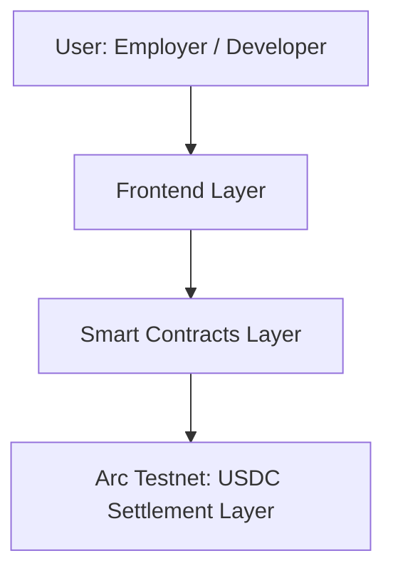
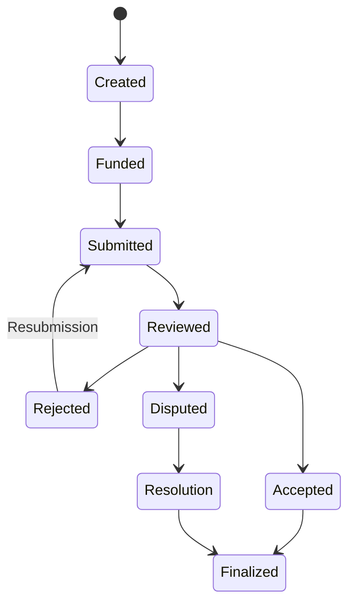
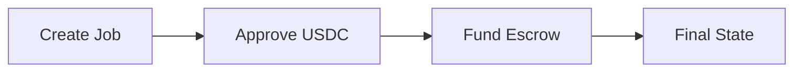

# ArcProof
### Deterministic Work Settlement Layer on @arc

ArcProof is a deterministic work settlement layer built on Arc. It is engineered to enforce programmable state transitions for work lifecycles, ensuring that execution outcomes correlate directly with onchain financial settlement.

ArcProof is NOT a marketplace, hiring platform, or freelancing application. It IS:
* A deterministic escrow execution system.
* An onchain work lifecycle engine.
* A USDC-native settlement infrastructure.

In this system, work is represented as a series of verifiable state transitions rather than static listings.

## System Overview

ArcProof operates as a hard-coded execution environment for work agreements. The protocol abstracts the horizontal complexities of "hiring" into a vertical settlement stack:
* **Deterministic Escrow Execution**: Funds are locked in a state-aware vault, releasable only upon reaching terminal success states.
* **Onchain Work Lifecycle Engine**: Enforces a strict sequence of events (Created -> Funded -> Submitted -> Reviewed -> Finalized).
* **USDC-Native Settlement**: Utilizes USDC as the primary accounting and settlement unit for sub-second deterministic finality.

## Core Problem

Current work-related infrastructure suffers from a critical execution gap:
* **Lifecycle Ambiguity**: No deterministic onchain enforcement of work progress or completion.
* **Fragmented Escrow**: Escrow systems typically lack a unified state machine, leading to "orphaned" funds or manual intervention.
* **Reputation Drift**: Reputation metrics are often decoupled from the actual financial settlement state.
* **Dispute Inconsistency**: Resolution mechanisms are frequently offchain, subjective, or protocol-agnostic.

## Execution Model

The ArcProof state machine enforces a rigid lifecycle for every escrowed job:

**Created** → **Funded** → **Submitted** → **Reviewed** → **Finalized**

* **State Enforcement**: Transitions are contract-enforced; a state cannot be bypassed.
* **Deterministic Outcomes**: Each job has exactly one final state (Completed, Cancelled, or Resolved via Dispute).
* **Zero Ambiguity**: Intermediate states are clearly defined and verifiable.

## Escrow Flow

The protocol mandates a precise sequence for financial commitment:
1. **Create Escrow Job**: Define parameters and target developer.
2. **Approve USDC**: Exact amount only; the protocol explicitly avoids unlimited approval patterns.
3. **Fund Escrow**: Transfer USDC to the deterministic vault.
4. **Submit Work**: Developer registers proof of execution.
5. **Review Outcome**: Employer evaluates the submission against the agreed state.
6. **Finalize State**: Transition to terminal state (Accepted / Rejected / Disputed Resolution).

## Architecture

### System Architecture

### State Machine Diagram

### Wallet Flow Diagram

## Smart Contracts

### JobEscrow.sol
The core execution engine. It manages the deterministic escrow vault and enforces the job lifecycle state machine. It handles the logic for funding, work submission, and payment release based on state transitions.

### ReputationRegistry.sol
An execution outcome registry. It tracks the historical state transitions of participants (e.g., success rates, dispute frequency) to provide a verifiable performance mapping based entirely on finalized settlement data. It manages the **DevScore**, a deterministic reputation scoring system updated onchain based on job execution outcomes.

## Escrow Board UI

The management interface is partitioned into deterministic state buckets:
* **Active Escrows**: Jobs in Funded or Submitted states.
* **Rejected State**: Jobs requiring resubmission or escalation.
* **In Dispute**: Jobs currently undergoing resolution.
* **Completed**: Jobs that have reached successful terminal settlement.
* **Cancelled**: Jobs terminated before assignment or funding completion.

## Reputation Model

Reputation in ArcProof is defined as a performance state tracking system:
* **Execution Outcome Registry**: Aggregates successful vs. failed state transitions.
* **Performance State Tracking**: Quantifies "Work Done" as "USDC Settled."
* **Dispute Mapping**: Tracks resolution history to identify risk profiles.
* **DevScore Index**: A real-time execution index computed from verifiable onchain outcome data. No NFT or identity framing is used.

## Arc Alignment

The system is optimized for the Arc ecosystem's performance characteristics:
* **USDC-Native Execution**: Built for the dominant settlement asset on Arc.
* **Deterministic Settlement**: Leverages high-speed block times for sub-second updates.
* **Arc Testnet Deployment**: Native integration with Arc chain parameters.
* **Lifecycle Alignment**: Follows architectural patterns conducive to high-fidelity onchain execution.

## UI Constraints

Wallet interactions are strictly sequenced to maintain system integrity:
1. **Create Job**: Initialize state.
2. **Approve USDC**: Authorize exact amount.
3. **Fund Escrow**: Lock capital.

**Final State**: *Escrow Finalized. Job Registered Onchain.*

## Deployment

**Network**: Arc Testnet  
**RPC Endpoint**: `https://rpc.arc.testnet`  

### Contract Addresses
* **JobEscrow**: `0xBa2B389B68E2cC6025AF235d460043c160D6bBa3`
* **ReputationRegistry**: `0x6453D3AbbB79ed84799EA65A313FA7054a3878C7`
* **USDC**: `0x3600000000000000000000000000000000000000`

---
*ArcProof: Deterministic execution for the work economy.*
